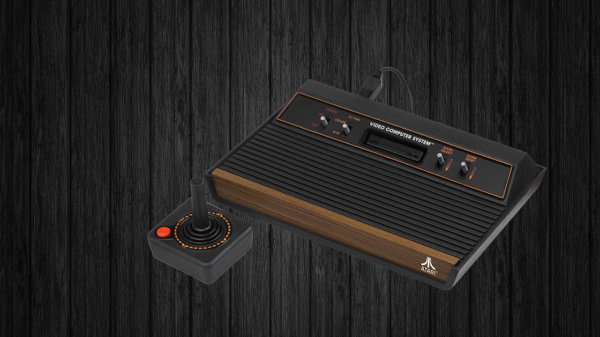
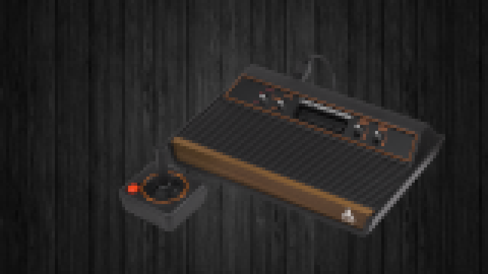
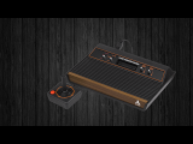
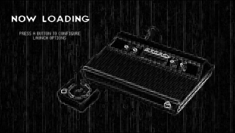

# URCade Project Emulationstation Themes

Welcome to the URCade Project Emulationstation themes repository! The most complete Emulation Station theme out there! These themes are designed for the URCade Project, covering nearly 200 systems with four unique styles. You can use these themes with any EmulationStation or Retropie installation or bundle them with an official [URCade image](https://surtarso.ddns.net/urcade-files/).
#### This theme was adapted, modified and extended from ['Super Display 3.0' by MrHArias](https://github.com/mrharias/es-theme-superdisplay)

## Installation Options

You have several installation options:

- **Download ZIP**: Download as a ZIP, extract and move your theme of choice into the themes folder.
- **URCade Servers**: Download individual themes directly from the [URCade servers](https://surtarso.ddns.net/urcade-files/)!
- **Launch Images**: Download [launch images](https://github.com/surtarso/es-theme-urcade/tree/main/launch_images) and copy to /opt/retropie/configs/
- **Tools**: Use our [custom collection creator](https://github.com/surtarso/es-theme-urcade/tree/main/tools) tool to easily map your roms to our themed collections, or create any list you desire!

### For Large Screens

- [es_theme_urcade_master](https://github.com/surtarso/es-theme-urcade/tree/main/es_theme_urcade_master): 16:9 large (clean)
  
  

    
  

    OBS: The master theme also contains custom collection themes for: batman castlevania donkeykong finalfantasy frogger mario megaman mortalkombat pacman sonic spaceinvaders starwars streetfighter tmnt zelda snes-hacks megadrive-hacks
### For Medium/Small Screens

- [es_theme_urcade_pi34_dark](https://github.com/surtarso/es-theme-urcade/tree/main/es_theme_urcade_pi34_dark): 16:9 medium (b/w pixelated)
  
  

    
  

- [es_theme_urcade_pi34](https://github.com/surtarso/es-theme-urcade/tree/main/es_theme_urcade_pi34): 16:9 medium (pixelated)
  
  
 <!-- Adjust the width as needed -->
      
  

### For Handhelds

- [es_theme_urcade_pi0](https://github.com/surtarso/es-theme-urcade/tree/main/es_theme_urcade_pi0): 4:6 small (dirt small)
  
  
 <!-- Adjust the width as needed -->
     
  

### Universal Launch Images

- [launch images](https://github.com/surtarso/es-theme-urcade/tree/main/launch_images): 480p (/opt/retropie/configs/)
  
  
 <!-- Adjust the width as needed -->
     
  

## Contribute

Contributions to this project are welcome! Feel free to open issues or submit pull requests.
