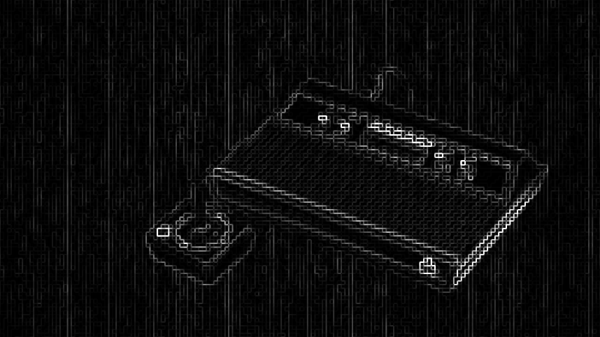

# URCade Project Emulationstation themes!
My EmulationStation themes for the [URCade Project](https://solidserverbr.ddns.net/urcade/). They cover almost 200 systems with 4 styles.
It can be used with any ES/Retropie installation or bundled with an official URCade image. 

## Installation:
You have options:
- straight up clone your chosen theme to your theme folder (easier to keep up-to-date)
- download the .zip and extract it in your theme folder
- download it from the [URCade servers](https://surtarso.ddns.net/urcade-files/)!

### .for large screens:
- [es_theme_urcade_master](https://github.com/surtarso/es-theme-urcade/tree/main/es_theme_urcade_master) 16:9 large (clean)

### .for medium/small screens:
- [es_theme_urcade_pi34_dark](https://github.com/surtarso/es-theme-urcade/tree/main/es_theme_urcade_pi34_dark) 16:9 medium (b/w pixelated)

- [es_theme_urcade_pi34](https://github.com/surtarso/es-theme-urcade/tree/main/es_theme_urcade_pi34) - 16:9 medium (pixelated)

### .for handhelds:
- [es_theme_urcade_pi0](https://github.com/surtarso/es-theme-urcade/tree/main/es_theme_urcade_pi0) - 4:6 small (dirt small)

